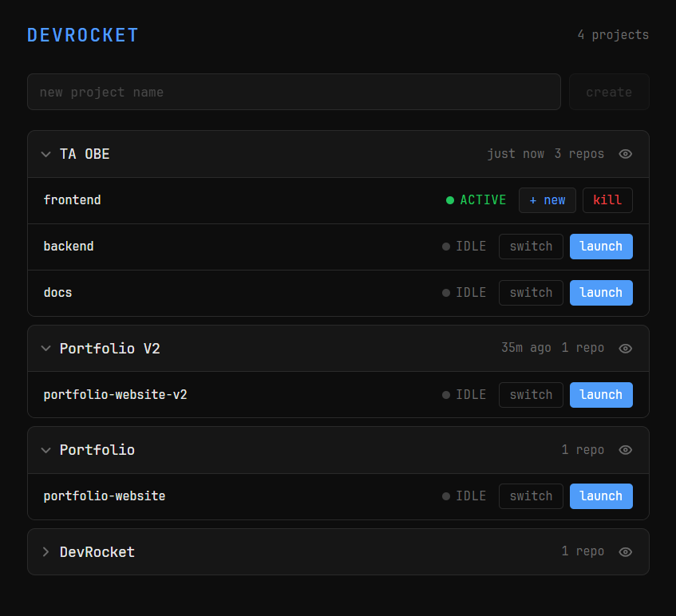
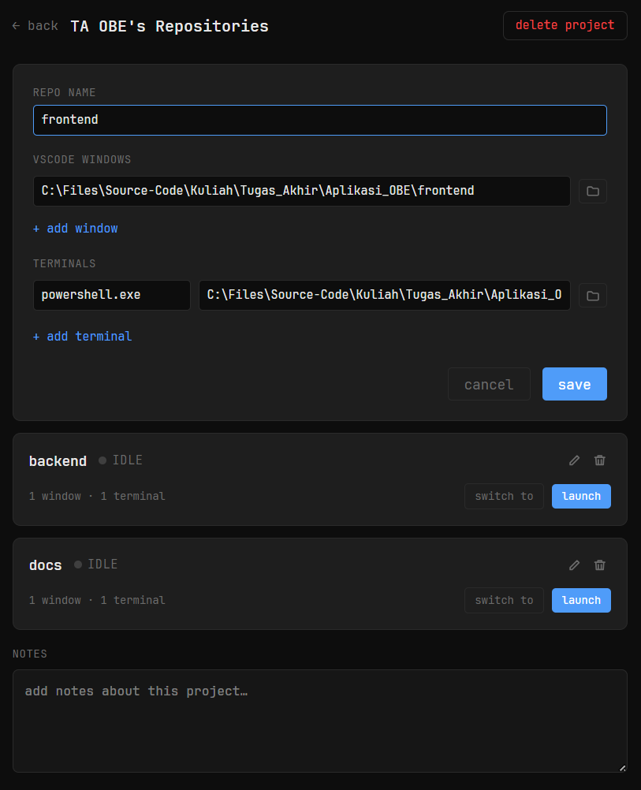

# DevRocket

A UI-based workspace manager for Windows developers. Define your projects, configure repositories with VSCode windows and terminals, and launch your entire dev environment in one click — or switch context instantly by killing your current session and spinning up a new one.

---

## Preview

<p align="center">
  
</p>
<p align="center">
  
</p>

---

## Features

- UI-based project and repository management with local JSON storage
- One-click launch of VSCode windows and terminal instances per repo
- Context switching — kill active sessions and launch a new one cleanly
- Independent multi-repo launching within a project
- Active session tracking with live status badges
- Accordion project list with inline launch controls
- Per-project notes with auto-save
- Dark, minimalist dev-focused UI

---

## Requirements

- Windows 10 or 11
- [Node.js](https://nodejs.org/) v18 or later
- [npm](https://www.npmjs.com/) v9 or later
- [Visual Studio Code](https://code.visualstudio.com/) with `code` available in PATH (for VSCode launch features)

---

## Setup

**1. Clone the repository**

```bash
git clone <repo-url>
cd devrocket-electron
```

**2. Install dependencies**

```bash
npm install
```

---

## Running in Development

```bash
npm run dev
```

This starts Electron with Vite's dev server and hot module reloading. Changes to the renderer update live; changes to the main process require a restart.

---

## Building for Production

**Package as a Windows `.exe`:**

```bash
npm run build:win
```

The packaged installer is output to `dist/devrocket-{version}-setup.exe`.

---

## Installing the Packaged App

Run `dist\devrocket-{version}-setup.exe`. The one-click installer requires no admin rights by default and installs to your user profile (`%LOCALAPPDATA%\Programs\devrocket`).

**Upgrading:** Just run the new installer over an existing installation — no need to uninstall first.

**Your data is never touched by install or uninstall.** Project configuration lives separately at `%APPDATA%\devrocket\projects.json` and persists across all installs, upgrades, and uninstalls.

---

## Uninstalling

**Option A — Settings:**
`Windows Settings → Apps → Installed apps → DevRocket → Uninstall`

**Option B — Start Menu:**
Right-click the DevRocket shortcut → Uninstall

To also remove your project data after uninstalling:

```
%APPDATA%\devrocket\
```

Delete that folder manually if you want a full clean removal.

---

## Project Structure

```
devrocket-electron/
├── src/
│   ├── main/        # Electron main process — IPC handlers, services
│   ├── renderer/    # React UI — views, components, hooks
│   └── preload/     # Context bridge — exposes IPC to renderer
├── docs/            # Spec, architecture, and plan documents
├── config/          # Build tool configs (Vite, electron-builder, Tailwind)
├── tsconfig.json
└── package.json
```

---

## Data Storage

All project and repository configuration is stored locally in a JSON file at:

```
%APPDATA%\devrocket\projects.json
```

No account, no cloud sync, no telemetry.

---

## Troubleshooting

**VSCode doesn't open when launching a repo**
Make sure `code` is available in your system PATH. Open a terminal and run:

```bash
code --version
```

If that fails, open VSCode, press `Ctrl+Shift+P`, and run **Shell Command: Install 'code' command in PATH**.

**Terminal doesn't open**
Check that the shell configured for the terminal instance (e.g. `powershell.exe`) exists at the specified path or is available in PATH.

**App shows a repo as active after manually closing it**
DevRocket polls process liveness every few seconds. The status badge will update automatically within 5 seconds of the process exiting.
