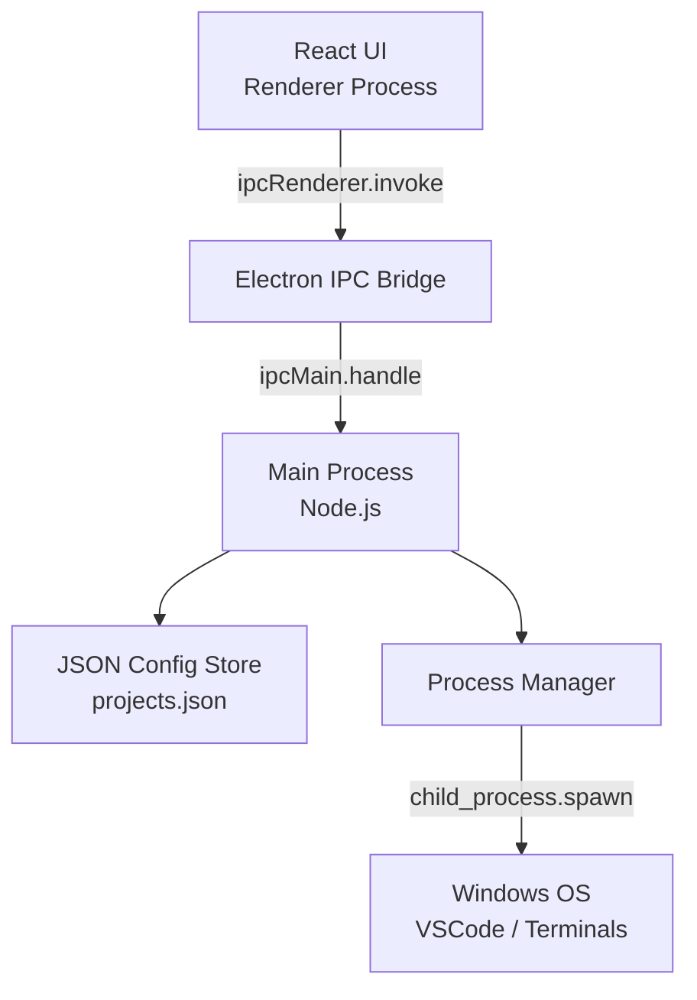
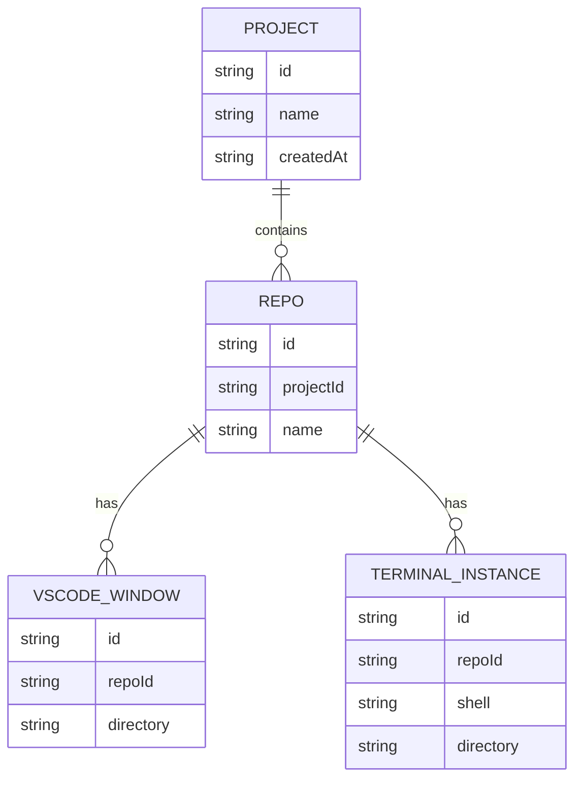

# devrocket — Architecture

## 1. System Overview



devrocket runs as a standard Electron app with two processes: the **Renderer** (React UI in a Chromium window) and the **Main** process (Node.js). All business logic — reading/writing config, spawning processes, tracking PIDs — lives exclusively in the Main process. The UI communicates with Main via Electron's IPC bridge using named channels. The config store is a single JSON file on disk; the Process Manager holds in-memory state about running sessions.

## 2. Component Breakdown

### Frontend (Renderer Process)

- **ProjectListView**
  - Responsibility: Displays all projects; entry point of the app.
  - Key interactions: Calls `projects:list` IPC to fetch projects; routes to `ProjectDetailView` on selection.

- **ProjectDetailView**
  - Responsibility: Shows a project's repos, their configs, and their active/inactive status.
  - Key interactions: Calls `session:status` to get active PIDs; triggers `session:launch`, `session:kill`, `session:switch` IPC calls.

- **RepoConfigForm**
  - Responsibility: Create/edit a repository — name, VSCode windows, terminal instances (shell, cwd).
  - Key interactions: Calls `projects:save` IPC on submit.

- **StatusBadge**
  - Responsibility: Visual indicator (active / inactive) on each repo card, driven by session state.
  - Key interactions: Receives session state as props; re-renders on IPC push events from Main.

### Backend (Main Process)

- **IPC Handler Layer** (`ipc/`)
  - Responsibility: Maps named IPC channels to service functions. Thin — no business logic here.
  - Key interactions: Bridges all `ipcMain.handle` calls to `ConfigService` and `SessionService`.

- **ConfigService** (`services/config.ts`)
  - Responsibility: Read, write, and validate `projects.json`. Handles atomic writes and backup.
  - Key interactions: Called by IPC handlers for all CRUD operations on projects and repos.

- **SessionService** (`services/session.ts`)
  - Responsibility: Spawns and kills processes; maintains in-memory PID map keyed by repo ID.
  - Key interactions: Uses `child_process.spawn` and `taskkill`; emits process-exit events back to the Renderer via `webContents.send`.

- **ProcessTracker** (`services/processTracker.ts`)
  - Responsibility: Polls or watches spawned PIDs for liveness; marks sessions dead when processes exit unexpectedly.
  - Key interactions: Called by `SessionService`; pushes `session:status-update` events to the Renderer.

### Storage

- **projects.json**
  - Responsibility: Single source of truth for all project/repo configuration.
  - Key interactions: Read/written exclusively by `ConfigService`. Location: Electron `userData` directory.

## 3. Data Schemas



- **PROJECT**: Top-level container. `id` is a UUID generated on creation.
- **REPO**: A named launch configuration within a project. A project can have 1–N repos.
- **VSCODE_WINDOW**: Spawns `code <directory>`. Multiple per repo allowed.
- **TERMINAL_INSTANCE**: Spawns a shell process at `directory`. `shell` is the executable path or name (e.g. `powershell.exe`, `cmd.exe`).

**In-memory session state** (not persisted):

```ts
type SessionState = {
  repoId: string
  pids: number[]       // all spawned PIDs for this repo
  active: boolean
}
```

## 4. API Design

devrocket has no HTTP API — all communication is via Electron IPC. Channels are grouped by domain:

### Config Channels

| Channel | Direction | Description |
|---|---|---|
| `projects:list` | invoke | Return all projects with their repos |
| `projects:create` | invoke | Create a new project; returns the created project |
| `projects:update` | invoke | Rename or update a project |
| `projects:delete` | invoke | Delete a project and all its repos |
| `repos:create` | invoke | Add a repo to a project |
| `repos:update` | invoke | Update repo config (windows, terminals) |
| `repos:delete` | invoke | Remove a repo from a project |

### Session Channels

| Channel | Direction | Description |
|---|---|---|
| `session:launch` | invoke | Spawn all windows/terminals for a repo; mode: `"new"` or `"switch"` |
| `session:kill` | invoke | Kill all PIDs for a given repo session |
| `session:status` | invoke | Return current in-memory session state for all repos |
| `session:status-update` | push (Main → Renderer) | Emitted when a process exits unexpectedly |

### System Channels

| Channel | Direction | Description |
|---|---|---|
| `system:check-vscode` | invoke | Check if `code` is available in PATH; return boolean |

## 5. File & Folder Structure

```
devrocket-electron/
├── src/
│   ├── main/                        # Electron Main process (Node.js)
│   │   ├── index.ts                 # App entry — creates BrowserWindow, registers IPC
│   │   ├── ipc/
│   │   │   ├── configHandlers.ts    # IPC handlers for projects/repos CRUD
│   │   │   └── sessionHandlers.ts   # IPC handlers for launch/kill/status
│   │   └── services/
│   │       ├── config.ts            # Read/write projects.json (atomic writes)
│   │       ├── session.ts           # Spawn/kill processes, manage PID map
│   │       └── processTracker.ts    # Poll PID liveness, emit exit events
│   │
│   ├── renderer/                    # React app (Vite, Renderer process)
│   │   ├── main.tsx                 # React entry point
│   │   ├── App.tsx                  # Root component, routing
│   │   ├── views/
│   │   │   ├── ProjectListView.tsx  # Home: list of all projects
│   │   │   └── ProjectDetailView.tsx # Project: repos + launch controls
│   │   ├── components/
│   │   │   ├── RepoCard.tsx         # Single repo display + action buttons
│   │   │   ├── RepoConfigForm.tsx   # Create/edit repo form
│   │   │   ├── StatusBadge.tsx      # Active/inactive indicator
│   │   │   └── ConfirmDialog.tsx    # Reusable confirmation modal
│   │   ├── hooks/
│   │   │   ├── useProjects.ts       # Data fetching + mutation for projects
│   │   │   └── useSession.ts        # Session state + IPC push listener
│   │   ├── ipc/
│   │   │   └── bridge.ts            # Typed wrappers around window.electron IPC calls
│   │   └── styles/
│   │       └── globals.css          # Tailwind base + custom dark theme tokens
│   │
│   └── preload/
│       └── index.ts                 # contextBridge — exposes safe IPC API to renderer
│
├── docs/
│   ├── spec.md
│   ├── architecture.md
│   └── plan.md
│
├── config/                          # Tool configs — kept out of root
│   ├── electron.vite.config.ts      # electron-vite build config (referenced via --config)
│   ├── electron-builder.config.ts   # Packaging config for .exe
│   └── tailwind.config.ts           # Tailwind theme + content paths
│
├── tsconfig.json                    # Must be at root (TS tooling requirement)
├── package.json                     # Must be at root (npm requirement)
└── README.md                        # App overview, setup steps, and run instructions
```

## 6. Key Design Decisions

- **Decision:** All business logic in Main process, UI is purely presentational.
  - **Why:** Renderer runs in a sandboxed Chromium context. Spawning processes, reading files, and managing PIDs require Node.js APIs that are only safe in Main. This also keeps the security surface small.
  - **Trade-off:** More IPC boilerplate; async round-trips for every action.

- **Decision:** Single `projects.json` file in Electron `userData`.
  - **Why:** Simplest possible persistence. No ORM, no migrations, no SQLite binary to package. For ~20 projects with a few repos each, a flat JSON file is fast and readable.
  - **Trade-off:** No query capability; entire file is read/written on every change. Acceptable at this scale.

- **Decision:** Atomic writes via temp file + rename for `projects.json`.
  - **Why:** Prevents config corruption on crash. Node's `fs.rename` is atomic on the same filesystem.
  - **Trade-off:** Slightly more complex write path than a direct `fs.writeFile`.

- **Decision:** In-memory session state — not persisted to disk.
  - **Why:** PIDs are transient OS artifacts. Persisting them would create stale state on restart. On app launch, all sessions start as inactive.
  - **Trade-off:** If devrocket crashes, it loses track of running processes until the user manually kills them or they naturally exit.

- **Decision:** Use `taskkill /F /T /PID` for process termination.
  - **Why:** Windows requires `/T` to kill the full process tree. Simply killing the parent PID leaves child processes (shell sub-processes, Node servers, etc.) orphaned.
  - **Trade-off:** Force-kills without graceful shutdown. Acceptable for a dev launcher — terminals don't hold unsaved state.

- **Decision:** `contextBridge` preload for IPC instead of `nodeIntegration: true`.
  - **Why:** Security best practice for Electron. Exposes only the specific IPC calls the UI needs, not the full Node.js API surface.
  - **Trade-off:** Requires maintaining a typed bridge in `preload/index.ts`.

## 7. Anti-patterns to Avoid

- **Anti-pattern:** Calling `child_process` or `fs` directly from the Renderer.
  - **Why it's tempting:** Electron used to allow `nodeIntegration: true` which makes this trivially easy.
  - **Better approach:** Keep `contextIsolation: true` and route all system calls through IPC + Main. The preload bridge provides a clean, typed API for the Renderer.

- **Anti-pattern:** Storing session state (PIDs) in React component state or a global store.
  - **Why it's tempting:** React state is easy; Redux/Zustand feels like the natural home for app state.
  - **Better approach:** Session state lives in Main process memory (`SessionService`). The Renderer fetches it via `session:status` and listens for push updates. This is the single source of truth — React just renders it.

- **Anti-pattern:** Writing `projects.json` on every keystroke in config forms.
  - **Why it's tempting:** Autosave feels user-friendly.
  - **Better approach:** Treat the form as local draft state; write to disk only on explicit save/submit. This avoids partial/invalid JSON states mid-edit.

- **Anti-pattern:** Using `process.kill(pid)` (Node's SIGTERM) instead of `taskkill`.
  - **Why it's tempting:** `process.kill` is the standard Node.js kill API.
  - **Better approach:** On Windows, SIGTERM does nothing to most processes. Use `taskkill /F /T /PID <pid>` via `child_process.exec` to guarantee process tree termination.

- **Anti-pattern:** Over-engineering the data layer with a database or ORM.
  - **Why it's tempting:** "What if it grows?" thinking leads to adding SQLite or a full DB.
  - **Better approach:** JSON file is correct for this scale. If it ever needs to grow, migrate then — don't pre-optimize.

## 8. Performance Notes

- **Area:** App startup time
  - **Risk:** Electron apps can be slow to start if the Main process does heavy work (file I/O, process scanning) on launch.
  - **Mitigation:** On startup, only read `projects.json`. Defer `session:status` polling until the UI requests it. Keep the BrowserWindow creation path free of blocking calls.

- **Area:** PID liveness polling
  - **Risk:** Polling every active PID on a tight interval (e.g. 100ms) burns CPU unnecessarily.
  - **Mitigation:** Poll at a relaxed interval (e.g. 2–5 seconds) or use `child_process` `'exit'` / `'close'` events where possible. Only fall back to polling for processes not directly spawned (e.g. VSCode spawns its own child and the original PID exits quickly).

- **Area:** Process spawn latency
  - **Risk:** Spawning 5+ processes simultaneously (multiple VSCode + terminals) could feel slow if done sequentially.
  - **Mitigation:** Spawn all processes in parallel using `Promise.all`. Each `child_process.spawn` is non-blocking — fire them all and collect PIDs.

- **Area:** JSON file read/write at scale
  - **Risk:** Not a real risk at 10–20 projects, but worth noting for completeness.
  - **Mitigation:** No mitigation needed. A 20-project JSON file will be a few KB. Read/write is sub-millisecond.
