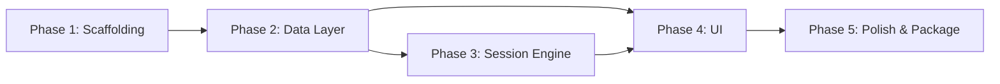
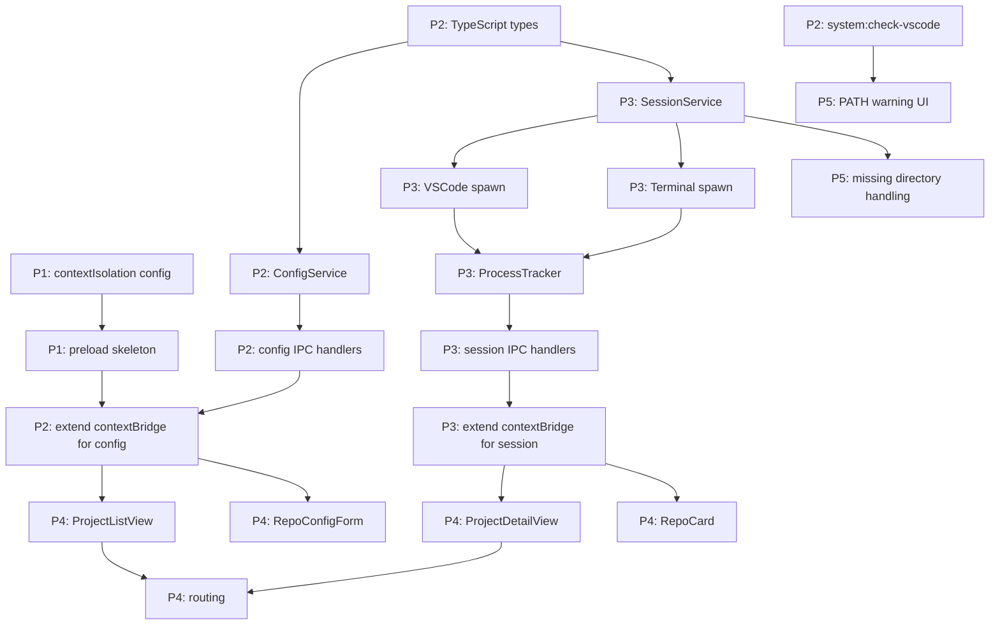

# devrocket — Implementation Plan

## 1. Plan Overview

devrocket is built in 5 phases, moving from scaffolding through core services to the full UI and then polish. The MVP (Phases 1–4) delivers a fully working launcher: users can define projects and repos, launch environments, track active sessions, and switch context. Phase 5 covers packaging and distribution.

- **Total phases:** 5
- **Rough total story points:** 52
- **MVP:** Phases 1–4 — usable app with all core features, runnable in dev mode
- **Verification:** Each phase ends with a "Run & verify" task — `npm run dev` must open the app successfully before moving to the next phase

---

## 2. Phase Dependency Graph

---

## 3. Phases

---

### Phase 1: Scaffolding
**Goal:** Working Electron + Vite + React + TypeScript project with correct security settings, folder structure, and build pipeline in place. No features yet — just a skeleton that runs.

**Definition of Done:** `npm run dev` opens an Electron window showing a placeholder React page. `npm run build` produces a packaged `.exe`.

**Depends on:** None

**Estimated total:** 10 story points

| # | Task | SP | Notes |
|---|------|----|-------|
| 1 | Init project with `electron-vite` template (React + TypeScript) | 2 | Use `npm create @quick-start/electron` or equivalent |
| 2 | **Run & verify** — `npm run dev` opens an Electron window with default template page | 1 | Do this immediately after init — confirms Electron is wired up before touching anything |
| 3 | Set up folder structure per architecture (`src/main`, `src/renderer`, `src/preload`, `config/`, `docs/`) | 1 | Move generated files into correct locations |
| 4 | Configure `contextIsolation: true`, `nodeIntegration: false` in BrowserWindow | 1 | Security baseline — do this before any other work |
| 5 | Set up `preload/index.ts` with empty `contextBridge` skeleton | 1 | Typed `window.electron` API surface ready to extend |
| 6 | Move tool configs to `config/` and update `package.json` scripts with `--config` flags | 1 | `electron.vite.config.ts`, `electron-builder.config.ts`, `tailwind.config.ts` |
| 7 | Install and configure Tailwind CSS with dark theme base | 1 | Add `globals.css` with dark background tokens |
| 8 | Configure `electron-builder` for Windows `.exe` packaging | 1 | Verify `npm run build` produces a working installer |
| 9 | **Run & verify** — `npm run dev` shows dark background with "devrocket" placeholder text | 1 | Confirms Tailwind, folder restructure, and preload all still work end-to-end |

---

### Phase 2: Data Layer
**Goal:** `ConfigService` reads and writes `projects.json` with atomic writes. All IPC channels for project/repo CRUD are wired up and callable from the renderer.

**Definition of Done:** Calling `projects:create`, `projects:list`, `repos:create`, `repos:update`, `repos:delete` via the IPC bridge from the renderer console returns correct results and persists to `projects.json`.

**Depends on:** Phase 1

**Estimated total:** 11 story points

| # | Task | SP | Notes |
|---|------|----|-------|
| 1 | Define TypeScript types for `Project`, `Repo`, `VSCodeWindow`, `TerminalInstance` | 2 | Shared types used by both main and renderer |
| 2 | Implement `ConfigService` — read/write `projects.json` with atomic temp-file write | 3 | Temp file + `fs.rename`; write `.bak` on each save |
| 3 | Implement `configHandlers.ts` — register all 7 config IPC channels | 2 | `projects:list/create/update/delete`, `repos:create/update/delete` |
| 4 | Extend `preload/index.ts` contextBridge to expose config channels | 1 | Typed wrappers in `renderer/ipc/bridge.ts` |
| 5 | Implement `system:check-vscode` IPC handler | 1 | `where code` / PATH check; warn if not found |
| 6 | Wire VSCode PATH check to run on app startup; log warning if absent | 1 | Main process only — no UI yet |
| 7 | **Run & verify** — `npm run dev` opens the app; call `projects:create` from DevTools console and confirm data persists in `projects.json` | 1 | Validates IPC bridge, ConfigService, and atomic writes are all wired correctly |

---

### Phase 3: Session Engine
**Goal:** `SessionService` can spawn VSCode windows and terminals for a repo, track their PIDs, kill them, and push status updates to the renderer when they exit unexpectedly.

**Definition of Done:** Given a hardcoded repo config, calling `session:launch` opens real VSCode and terminal windows. `session:kill` closes them. `session:status` reflects liveness correctly within 5 seconds of a manual close.

**Depends on:** Phase 2 (needs typed repo config from ConfigService)

**Estimated total:** 11 story points

| # | Task | SP | Notes |
|---|------|----|-------|
| 1 | Implement `SessionService` — in-memory PID map, `launchRepo(repo, mode)`, `killRepo(repoId)` | 5 | Core of the app; handles `"new"` and `"switch"` modes. `"switch"` kills all active sessions first |
| 2 | Implement VSCode spawn — `child_process.spawn('code', [directory])` per `VSCodeWindow` | 2 | Parallel spawn via `Promise.all`; collect PIDs |
| 3 | Implement terminal spawn — `child_process.spawn(shell, [], { cwd: directory })` per `TerminalInstance` | 2 | Support `powershell.exe`, `cmd.exe`; spawn in new window via `start` or `conhost` |
| 4 | Implement `ProcessTracker` — poll PID liveness every 3s; emit `session:status-update` on exit | 2 | Use `process.kill(pid, 0)` to test liveness without signalling |
| 5 | Implement `sessionHandlers.ts` — register `session:launch`, `session:kill`, `session:status` IPC channels | 1 | Thin handlers delegating to `SessionService` |
| 6 | Extend `preload/index.ts` contextBridge to expose session channels + push listener | 1 | `window.electron.onSessionUpdate(cb)` for renderer to subscribe |
| 7 | **Run & verify** — `npm run dev` opens the app; call `session:launch` from DevTools console with a hardcoded repo config and confirm VSCode + terminal open; call `session:kill` and confirm they close | 1 | The single most important smoke test in the project — validates the entire session engine |

> 💡 Suggested — Task 3 note: opening terminals as new visible windows on Windows requires spawning via `start powershell` or using the `CREATE_NEW_CONSOLE` flag. Test this early.

---

### Phase 4: UI
**Goal:** Full React UI — project list, project detail with repo cards, repo create/edit form, launch/kill/switch actions, and live session status badges.

**Definition of Done:** A user can create a project, add a repo with VSCode + terminal config, launch it, see it marked active, kill it, and switch context — all through the UI without touching the console.

**Depends on:** Phase 2 (data layer IPC) and Phase 3 (session IPC)

**Estimated total:** 13 story points

| # | Task | SP | Notes |
|---|------|----|-------|
| 1 | Set up client-side routing — `ProjectListView` and `ProjectDetailView` | 1 | Use `react-router-dom` or simple state-based routing (no URL needed) |
| 2 | Build `ProjectListView` — list projects, create new, delete | 3 | Calls `projects:list`, `projects:create`, `projects:delete`; dark card layout |
| 3 | Build `ProjectDetailView` — list repos, show active status, launch/kill/switch buttons | 3 | Calls `session:status` on mount; subscribes to `session:status-update` push |
| 4 | Build `RepoCard` component — name, status badge, action buttons (Launch New, Switch To, Kill) | 2 | Conditional button rendering based on active state |
| 5 | Build `StatusBadge` component — green "active" / grey "inactive" indicator | 1 | Pure display component driven by session state |
| 6 | Build `RepoConfigForm` — create/edit repo with VSCode window list and terminal list | 3 | Dynamic add/remove rows for windows and terminals; calls `repos:create` or `repos:update` |
| 7 | Build `ConfirmDialog` — reusable modal for destructive actions (kill, delete, switch) | 1 | Used for Kill and Switch To confirmations |
| 8 | Implement `useProjects` and `useSession` hooks | 2 | `useProjects`: fetch + mutate project data. `useSession`: session state + push listener |
| 9 | **Run & verify** — `npm run dev` opens the app; create a project, add a repo, launch it from the UI, confirm status badge turns active, kill it, confirm badge resets | 1 | Full end-to-end smoke test through the UI — if this passes, the MVP is functionally complete |

> 💡 Suggested — For routing, avoid adding `react-router-dom` unless URL-based navigation is needed. Simple `useState` with a view enum keeps it lighter for a single-window app.

---

### Phase 5: Polish & Package
**Goal:** App feels complete — VSCode PATH warning visible in UI, edge cases handled, packaged as a distributable `.exe`.

**Definition of Done:** App is packaged, runs on a clean Windows machine without Node installed, shows a warning if VSCode is not in PATH, and handles missing repo directories gracefully.

**Depends on:** Phase 4

**Estimated total:** 5 story points

| # | Task | SP | Notes |
|---|------|----|-------|
| 1 | Show VSCode PATH warning in UI if `system:check-vscode` returns false | 1 | Banner or inline warning on first launch |
| 2 | Handle missing repo directory at launch time — show error toast, abort launch | 1 | Check directory exists before spawning; surface error to renderer |
| 3 | Add rename support for projects and repos in the UI | 1 | Inline edit or small form; calls `projects:update` / `repos:update` |
| 4 | Final dark theme pass — spacing, typography, hover states, consistent button styles | 1 | Visual polish; no new functionality |
| 5 | Test packaging — verify `.exe` installs and runs on a clean Windows machine | 1 | Catch missing native deps or path issues in the build |
| 6 | **Run & verify** — install the packaged `.exe`, launch the app, run through the full flow (create project → launch repo → switch context → kill) | 1 | Final verification in production mode, not dev — confirms the build is shippable |

---

## 4. Task Dependency Graph

---

## 5. Critical Path

> P1T3 (contextIsolation) → P1T4 (preload skeleton) → P2T1 (TypeScript types) → P2T2 (ConfigService) → P2T3 (config IPC handlers) → P2T4 (extend contextBridge) → P3T1 (SessionService) → P3T2/T3 (spawn) → P3T4 (ProcessTracker) → P3T5 (session IPC handlers) → P3T6 (extend contextBridge session) → P4T3 (ProjectDetailView) → P4T1 (routing) → P5 (polish)

**Why this chain is the critical path:**

- The preload/contextBridge setup (P1T3–4) must precede all IPC work — nothing communicates until this exists.
- The TypeScript shared types (P2T1) unblock both ConfigService and SessionService — two separate workstreams depend on it.
- ConfigService (P2T2–T3) must exist before SessionService can load repo configs to know what to spawn.
- SessionService + ProcessTracker (P3T1–T4) is the core of the app — no launch, kill, or status tracking without it.
- ProjectDetailView (P4T3) is the most complex UI component, depending on both data and session IPC being wired. It's the last gate before the app is functionally usable.
